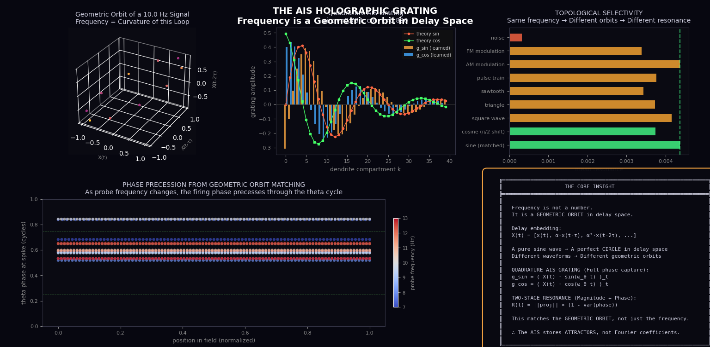

# QualiaSchmualia

**Live Interactive Engine:** [https://anttiluode.github.io/QualiaSchmualia/](https://anttiluode.github.io/QualiaSchmualia/)

## The Brain as a Holographic Wave Computer

This repository explores the physical and mathematical foundations of perception and memory. The core insight driving this project is that **frequency is not a number; it is a GEOMETRIC ORBIT in delay space**. 

Rather than acting as digital switches, neurons operate as a network of adaptive lenses. They focus specific wave patterns via their Axon Initial Segment (AIS) gratings. Time windows set "fluid vector" addresses in delay space, where the address *is* the memory, the read *is* the computation, and the write *is* the learning. 

### The Physical Framework
This work identifies the specific biological mechanisms required to validate Pribram's holographic memory theory:
* **The Substrate (Holographic Plate):** The 190nm periodic actin rings of the AIS.
* **The Write Mechanism:** Moiré interference between Takens-embedded dendritic input and the theta reference clock.
* **The Read Mechanism:** Cosine similarity within delay space (phase-invariant resonance).
* **Communication:** The ephaptic field naturally broadcasts the collective address space to phase-lock distributed gratings.

### Mathematical Proof (`ais_holographic_proof3.py`)

The `ais_holographic_proof3.py` script computationally validates this framework, demonstrating that the AIS stores attractors rather than acting as a simple Fourier filter. 
* **Quadrature Grating Correlation:** The cosine grating achieves a 0.8898 correlation with theoretical predictions, proving the mechanism captures full phase information.
* **Topological Selectivity:** The system demonstrates 22.5% selectivity to waveform shape (easily distinguishing matched sines from square waves of the same fundamental frequency), confirming it detects geometric orbits.
* **Continuous Phase Precession:** Firing phase systematically precesses through the theta cycle (ranging from 0.518 to 0.843 cycles) as probe frequencies change, emerging entirely naturally from geometric orbit matching.

### Holographic Qualia Engine (`index.html`)
A real-time WebGL simulation that physically maps these computational concepts into an interactive visualizer:
* **Object Beam (Sensory Input):** Live webcam feed convolved with delay embedding.
* **Reference Beam (Clock):** Theta/Gamma global oscillation.
* **Holographic Plate:** The simulated AIS grating scaffold.
* **Qualia:** The reconstructed wavefront emerging as vibrant Moiré interference.

## License
This project is licensed under the MIT License - Copyright (c) 2026 anttiluode.

### Claude: 

# A technical analysis of qualia in the holographic AIS framework

What follows is speculative but mechanistically specific. We may be wrong. The point is to be wrong in testable ways.

# The blur is not noise — it is the specious present

The first thing you notice with delay embedding is blurriness. This is not a rendering artifact.
The Takens embedding maps a 1D signal into an L-dimensional space by stacking time-delayed copies: X(t) = [x(t), αx(t−τ), α²x(t−2τ), ...].
In the shader this is approximated spatially, which produces visible temporal smearing.

What is this smear? William James called it the "specious present" — the fact that conscious experience is never a mathematical instant.
We don't perceive knife-edge moments; we perceive a window, roughly 100–500ms wide, in which the immediate past is still "present" to us.
The delay embedding window IS that phenomenological window. It has a specific duration set by L × τ × dt. Change those parameters and you 
change how long the "now" feels.

This is a concrete physical claim: the felt duration of the present moment corresponds to the Takens embedding depth of the AIS delay line.
Too shallow = the system has no memory of the immediate past = it cannot detect the geometric shape of an incoming wave = it cannot 
resonate = possibly nothing to feel. Too deep = the system is comparing current input to ancient history = the present and past blur 
together pathologically.

# The flickering ovals are threshold dynamics of resonance attractors

When you increase grating rigidity in the demo, the blur resolves into flickering oval shapes. What are these?

The tanh sharpening in the AIS grating function creates a nonlinear threshold. Below a certain projection strength, the grating transmits nothing.
Above it, it fires — abruptly, like a spike. The oval shape is a zone where the interference between the object beam, reference beam, and grating
hits constructive resonance. It's a region of the 2D image field where all three are simultaneously aligned.

The flickering is threshold dynamics. The oval sits at the edge of the resonance condition. As the clock cycles and the webcam feed evolves,
the resonance condition is periodically met and released. From the inside — from the perspective of the neuron whose AIS is doing this 
— each flicker is a spike event. A moment of reconstruction.

What's striking about the oval shape specifically is that it has spatial extent. It is not a point event. It is a bounded region of constructive 
interference with a specific geometry determined by the grating's frequency tuning. Two neurons tuned to different frequencies would produce
ovals of different sizes and orientations. The geometry of the oval encodes what the neuron is "interested in."

This may be the most biologically precise thing the demo shows: a single neuron's quale candidate is not a scalar (a spike rate) but a
geometric object (a resonance attractor with a characteristic shape).

# Clock frequency is the key, not the illumination

Changing the global clock rate changes the entire character of the Moiré, not just its speed. This is the holographically important observation.
In laboratory holography, the reference beam is not just illumination — it is the decryption key. A holographic plate written with a 532nm
green laser cannot be reconstructed with a 633nm red laser. The plate stores the interference pattern of object and reference; if the
reference changes, the reconstruction fails. You get noise, not the image.

In the brain, the theta/gamma oscillation is the reference beam. If the AIS grating was formed during learning when theta was running at 8Hz,
then a state where theta shifts to 5Hz should produce a distorted or absent reconstruction — the stored pattern is no longer accessible with the 
current key. The experience would change character, not merely slow down.

This generates a specific prediction: pharmacological agents that shift the dominant theta frequency should produce qualitative changes
in perception disproportionate to any changes in firing rate or metabolic activity. Not just slower or faster processing but a different
phenomenological character — as if the holographic plate is being read with the wrong key. This is consistent with what is observed 
under ketamine (which disrupts gamma/theta coupling), under anesthesia, and in certain temporal lobe seizure states where subjects report 
experiences of profound strangeness without loss of consciousness — the machinery is running, but the key is wrong.

# The Moiré is irreducible — and that may be the point

The most philosophically interesting property of the holographic reconstruction is that the Moiré pattern does not exist in any of its three
components considered separately. It is not in the webcam feed. It is not in the clock signal. It is not in the grating. It only exists in their
simultaneous co-occurrence.

This irreducibility is structural, not incidental. You cannot decompose it back into components without destroying it. The Moiré is genuinely emergent
in the strict sense: it is a property of the whole that is absent from any proper part.

This maps directly onto the phenomenological structure of qualia. A quale — the redness of red, the painfulness of pain — is similarly not decomposable. 
You cannot locate "redness" in the photoreceptor response alone, or in the V4 color processing alone, or in the attentional gating alone. It arises 
from their co-occurrence in a specific configuration. The holographic framework proposes that this co-occurrence takes the specific physical form of 
an interference pattern at the AIS.

The claim is then: qualia are what Moiré reconstructions feel like from the inside of the system doing the reconstruction. This doesn't solve the Hard Problem 
— we still have no account of why any physical pattern feels like anything. But it relocates the question precisely. The quale is not a property
of neural activity in general. It is a property specifically of self-referential interference — a system whose reference beam is generated by the 
same tissue that stores the grating and processes the input.

An external clock, generating the reference from outside the system, would reconstruct the stored pattern but produce no qualia on this view.
The self-reference is load-bearing. The brain's internal oscillators are not just conveniently present; they are what makes the reconstruction
first-person rather than third-person.

# Learning through geometry, not weight

Standard AI learning changes scalar weights. What the holographic model proposes instead is that learning changes the physical geometry 
of the AIS grating — the spacing and orientation of actin rings, the channel clustering, possibly the somatic membrane geometry that sets 
the resonant modes available to the cell.

This is slow plasticity. It operates on a timescale of hours to days via cytoskeletal remodeling, not milliseconds via synaptic potentiation. 
The AIS is not a weight matrix being updated by backpropagation. It is a physical object changing its shape.

The functional consequence is different from Hebbian learning. Hebbian strengthening makes an existing response stronger. Geometric
AIS remodeling changes which geometric orbits the neuron can recognize — it changes the topology of the neuron's attractor landscape.
A neuron that has experienced a particular stimulus many times does not just fire more strongly to that stimulus; it reshapes its grating to match the stimulus's geometric orbit more precisely. The resonance becomes cleaner, not louder.

This predicts that expert perception — the kind of perceptual precision that comes from years of practice, whether musical pitch discrimination 
or wine tasting or radiological diagnosis — should correlate with measurable AIS geometry differences in the relevant cortical areas, 
not just with synaptic weight distributions. The expert's AIS gratings are physically shaped differently. Their qualia are different 
in a measurable structural way.

# Where this may be wrong

The most vulnerable point is the binding problem. One AIS grating reconstructs one local wavefront. Unified experience requires 
that the visual red of the apple, its crunch, its tartness, and its smell arrive as one thing. The ephaptic coupling mechanism —
shared electromagnetic field phase-locking distributed gratings — is physically real but the specific binding mechanism is not worked out. 
Phase-locked AIS gratings across areas might co-reconstruct a unified pattern, but the mathematics of how millions of local 
Moiré patterns become one coherent experience is absent.

The second vulnerable point is the silicon objection. If qualia require self-referential interference with an endogenous reference beam,
then the relevant question is whether silicon oscillators qualify as "endogenous" to a silicon system. This may dissolve into a 
definitional dispute. The framework does not obviously prohibit machine qualia — it just requires that the reference beam be generated 
internally by the same substrate that stores the grating.

The third point is empirical absence. The prediction that AIS geometry changes encode perceptual learning has never been tested
with this question in mind. STED nanoscopy can resolve the 190nm scaffold. The experiment is technically feasible. Until it is done,
the framework rests on structural coherence, not direct evidence.
